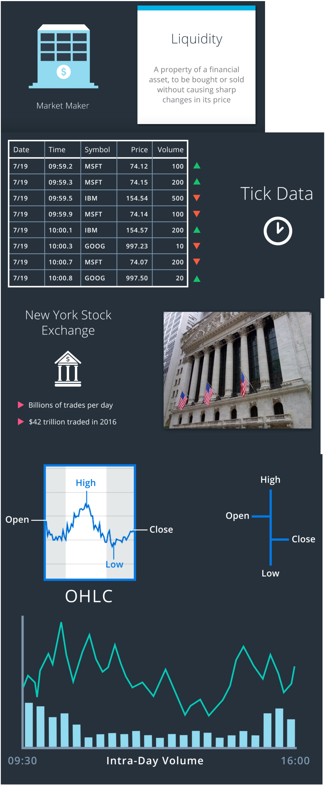
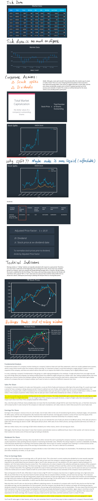

# Stock Prices

**Stock**: An asset that represents **ownership** in a company. A claim on part of a corporation's assets and earnings. There are two main types, common and preferred.

**Share**: A single share represents partial ownership of a company relative to the total number of shares in existence.

**Common Stock**: One main type of stock; entitles the owner to receive dividends and to vote at shareholder meetings.
* Receive a portion of profit as dividends.
* Able to vote on decisions.
* Receive a portion of remaining assets in case of liquidation.
  
**Preferred Stock** (more like a bond): The other main type of stock; generally does not entail voting rights, but entitles the owner to a higher claim on the assets and earnings of a company.
* Promised a fixed amount of income each year.
* Get paid before common stock holders get paid dividends.
* Usually do not have voting rights.

**Dividend**: A partial distribution of a company's profits to shareholders.

**Capital Gains**: Profits that result from the sale of an asset at a price higher than the purchase price.

**Security**: A tradable financial asset. A Financial instrument that has some type of monetary value.

* **Debt Security**: Money that is owed and must be repaid, like government or corporate bonds, or certificates of deposit. Also called fixed-income securities.

* **Derivative Security**: A financial instrument whereby its value is derived from other assets.

* **Equity Security**: A security that represents fractional ownership in an entity, such as stock. (**Equity**: The value of an owned asset minus the amount of all debts on that asset.
)

**Option Contract**: A contract which gives the buyer the right, but not the obligation, to buy or sell an underlying asset at a specified price on or by a specified date.

**Futures Contract**: A contract that obligates the buyer to buy or the seller to sell an asset at a predetermined price at a specified time in the future.

# Market Mechanics

## Buy Side and Sell Side
We’ve just seen that there are buyers and sellers who go through the stock exchange to buy a stock that they think will do well, or sell a stock that they wish to remove from their investments. We’ve also introduced the market maker, who serves as the counterparty of these buyers or sellers. Since every buyer needs a seller, and every seller needs a buyer, a market maker plays the role of seller to those who wish to buy, and plays the role of buyer for those who wish to sell. By convention, we refer to these market makers as the “sell side” of the finance industry. The sell side includes investment banks such as Goldman Sachs and Morgan Stanley. The buy side refers to individual investors, and investment funds such as mutual funds and hedge funds. We focus on the perspective of the “buy side”. However, it’s good to learn about the “sell side”, because these are the people that the “buy side” usually does business when they enter the market to buy or sell stocks.

Market makers could make profits from commission fees and bid-ask spread.

Importantly, market makers provide liquidity.

# Market Data Processing
