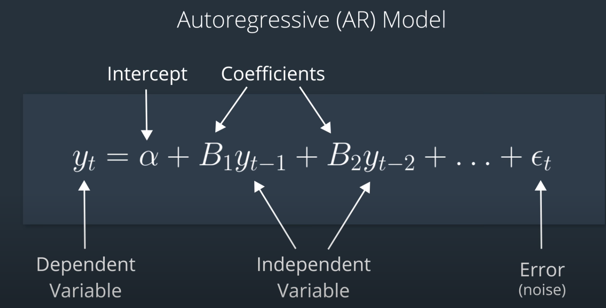
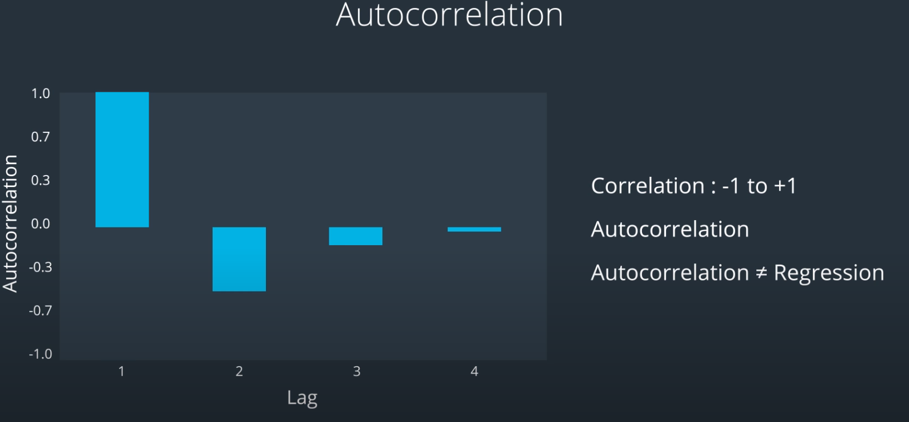
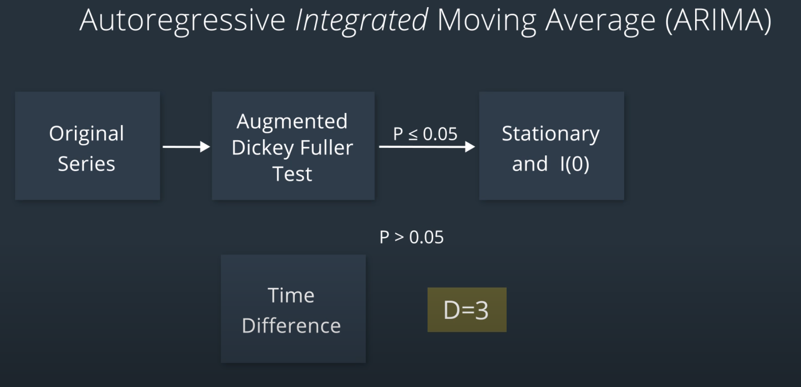

## Intro
Stock prices change over time so they are not stationary with mean and standard deviation change over time. To work with data that is more stationary and more normally distributed, we use log returns.

## Autoregressive (AR) Model
Predict future values based on a linear combination of previous values.

## Moving Average (MA) Model
Autocorrelation: Measures how much the current value moves in relation to one of its previous values.

## Autoregressive (AR) Integrated Moving Average
Combines autoregressive and moving average in prediction using integrated (stationary) time series.

Time series data may not be stationary (e.g., price) making it hard to use the past to predict the future. One way to get a stationary time series is to take the difference between points in the time series (e.g., returns and log returns). Therefore, we say the price is integrated of order 1 (l(1)) and log return is integrated of order 0 (l(0)) .

## [Kalman filter](Side-projects/1D-Kalman-filter.ipynb)
One way Kalman Filters are used in trading is for choosing the hedge ratio in pairs trading. For now, imagine that there’s a magic number that you can estimate from a model, such as a regression model, based on time series data of two stocks.

Every day when you get another data point, you can run another regression and get an updated estimate for this number. So do you take the most recent number every time? Do you take a moving average? If so, how many days will you average together? Will you give each day the same weight when taking the average?

All of these kinds of decisions are meant to smooth an estimate of a number that is based on noisy data. The Kalman Filter is designed to provide this estimate based on both past information and new observations. So instead of taking a moving average of this estimate, we can use a Kalman Filter.

The Kalman Filter takes the time series of two stocks, and generate its “smoothed” estimate for this magic number at each new time period. Kalman Filters are often used in control systems for vehicles such as cars, planes, rockets, and robots. They’re similar to the application in pairs trading because they take noisy indirect measurements at each new time period in order to estimate state variables (location, direction, speed) of a system.

