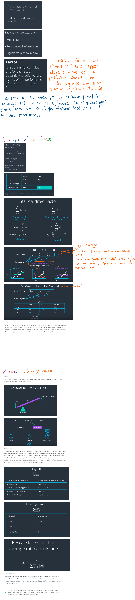

#### In previous modules, we developed trading strategies with large baskets of stocks and use optimization to find combinations of weights on stocks to seek the highest return for a given level of risk. We'll now learn how to develop models of portfolio returns and risk and add these into our optimization framework. Before, we always talked about the distribution of future log returns and it's mean and standard deviation like these were numbers we can just read off of a list somewhere. But in general this is not the case. Otherwise, all this would be easy. In addition, we aren't going to explicitly model returns in the way you might expect. The problem with explicit estimation of returns is that these estimates are very noise. Noise causes unnecessary trading which we want to avoid bc trades are costly. In this module, we will focus on the drivers of mean returns and drivers of volatility as the basis of our model. Drivers of mean returns are alpha factors and drivers of volatility are risk factors. This lessons shows an example of factor and how to standardize it so that it can be interpreted as a set of weights for a theoretical portfolio.

