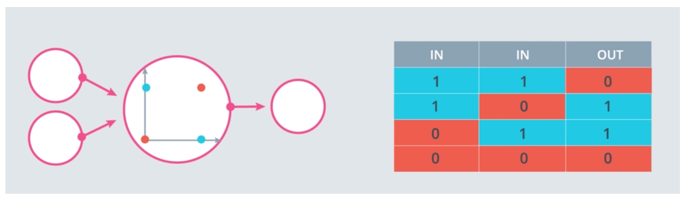
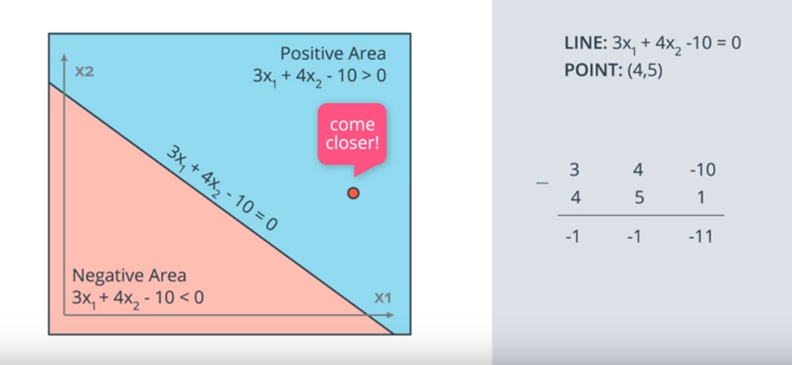
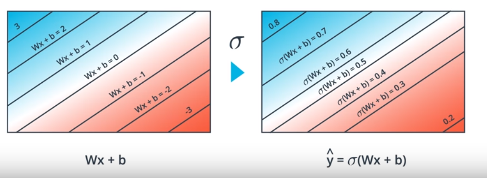
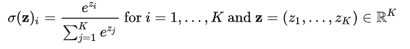

# Introduction to Neural Networks
## **AND, OR, XOR** using neural networks

1. AND

2. OR

3. XOR

## Intuition: find the binary classification line.

Points correctly classified are good. Points are misclassified want the line to move closer to them. 

To move a line closer to a point, we just need to modify the line equation's coefficient by subtracting the points coordinates (with bias 1) (TODO: math?). We need to use a learning rate to control the speed of the line moving to the point.

Algorithm:

We need a continuous and differentiable error function in order to use gradient decent.

We use activation function to let each unit returns continuous probabilities:

### Softmax
Essentially, we want to convert the generated scores (z) to probability range in [0, 1]. Since the z could be negative, we need to apply exponential before normalization.

