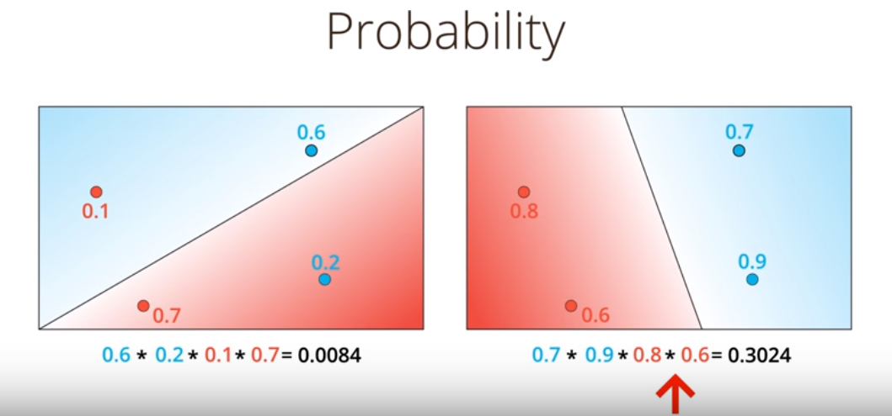
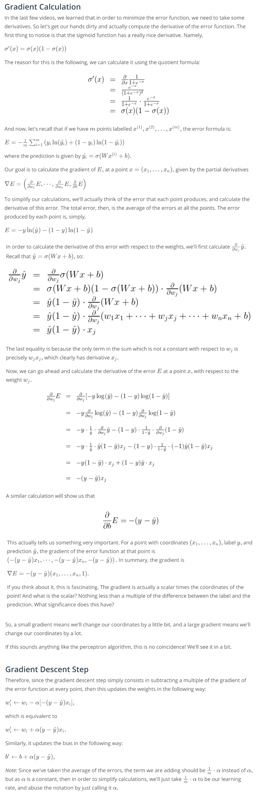
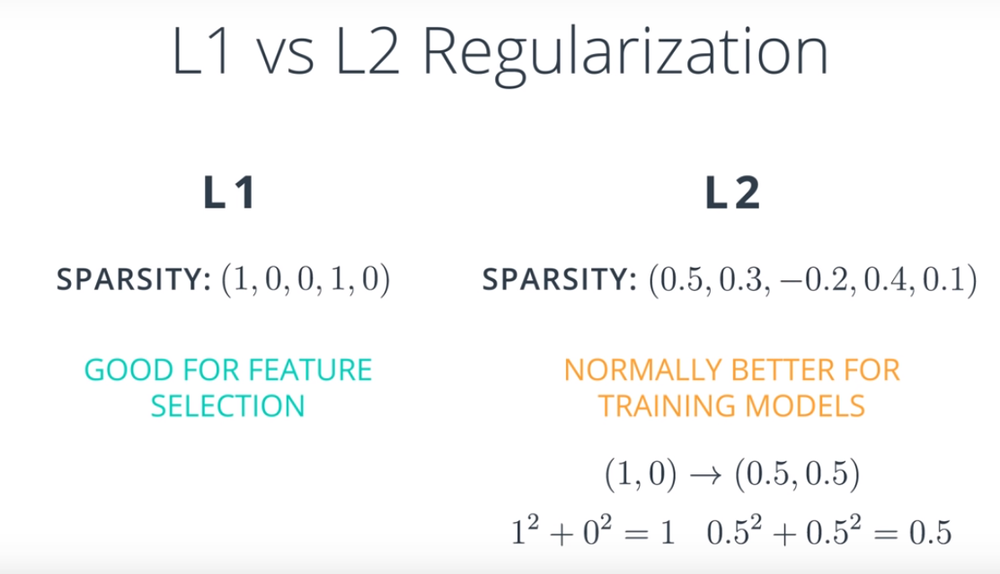
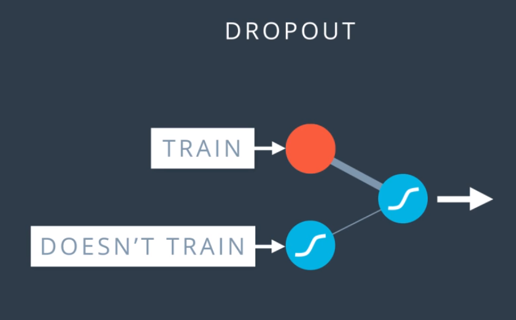
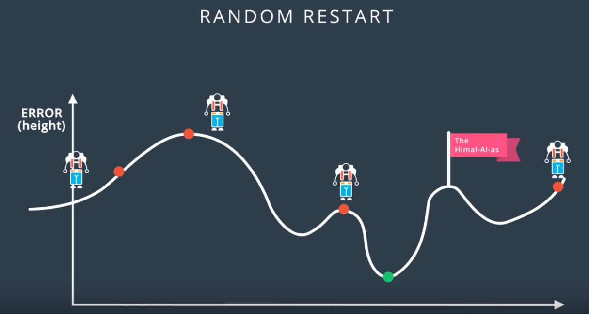
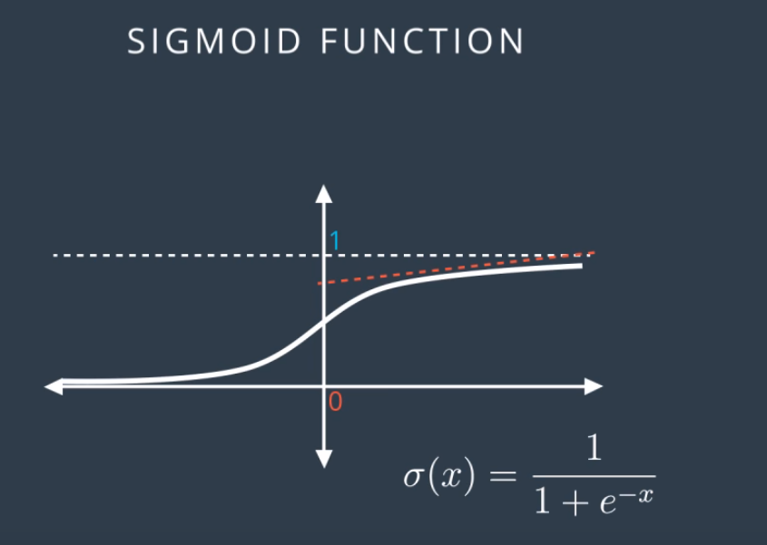
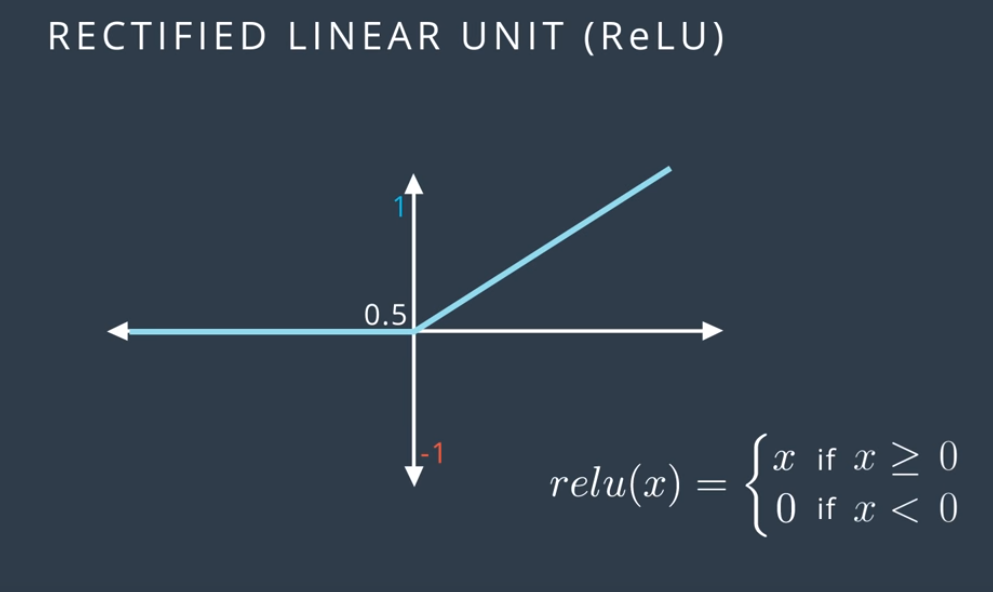

# Introduction to Neural Networks
## **AND, OR, XOR** using neural networks

1. AND

2. OR

3. XOR

## Intuition: find the binary classification line.

Points correctly classified are good. Points are misclassified want the line to move closer to them. 

To move a line closer to a point, we just need to modify the line equation's coefficient by subtracting the points coordinates (with bias 1) (TODO: math?). We need to use a learning rate to control the speed of the line moving to the point.

Algorithm:

We need a continuous and differentiable error function in order to use gradient decent.

We use activation function to let each unit returns continuous probabilities:

### Softmax
Essentially, we want to convert the generated scores (z) to probability range in [0, 1]. Since the z could be negative, we need to apply exponential before normalization.

### One-hot Encoding
If we have multiple classes, we can not simply label then as 1, 2. 3, ... Because that will introduce dependencies, e.g, 1 is closer to 2 than 5. We can use one-hot encoding to generate independent labels.

## Maximum Likelihood
A good model should give higher probabilities to sampling events occurred. 

# Cross Entropy
Given a bunch of events and probabilities, cross entropy measures how likely the events happen based on the probabilities. If it is very likely, then we have a small cross entropy. Otherwise, we have a large cross entropy.

A good model has small cross entropy to sampling events.

## Logistic Regression (Binary Classification)

# Training Neutral Networks
Keep training the neutral network until testing error start increasing. 

## Regularization

## Vanishing Gradient

Batch vs Stochastic Gradient Descent

