# Decision Tree

## Entropy

Entropy measures number of possibilities to organize balls?

Entropy measures the knowledge of the color of the ball?

### Entropy Formula

Let's play a game. Pick 4 balls from the basket with replacement. Win the game if the colors of the 4 balls (order matters) matches the ones in the basket.

## Information Gain

# Model Testing and Evaluation
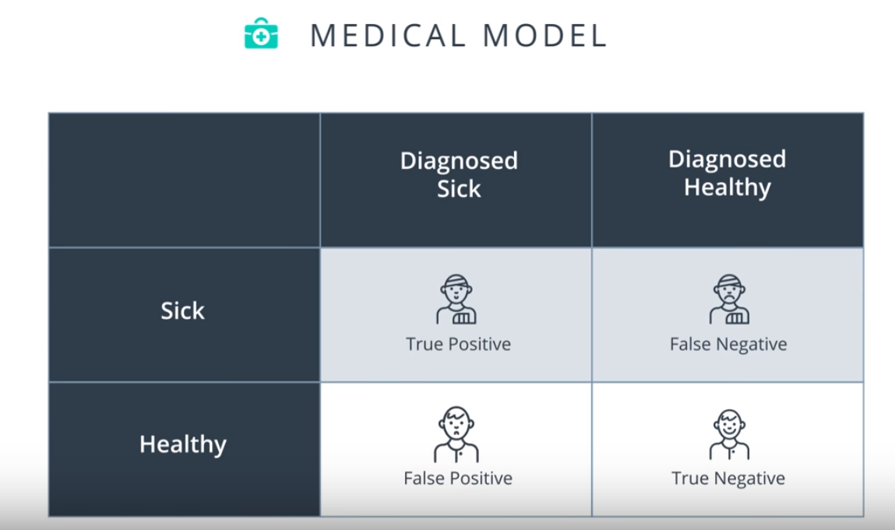

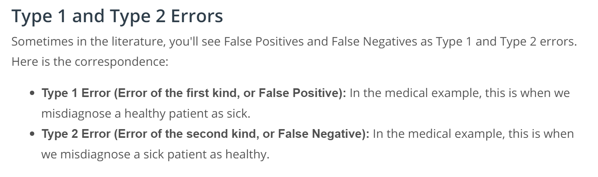
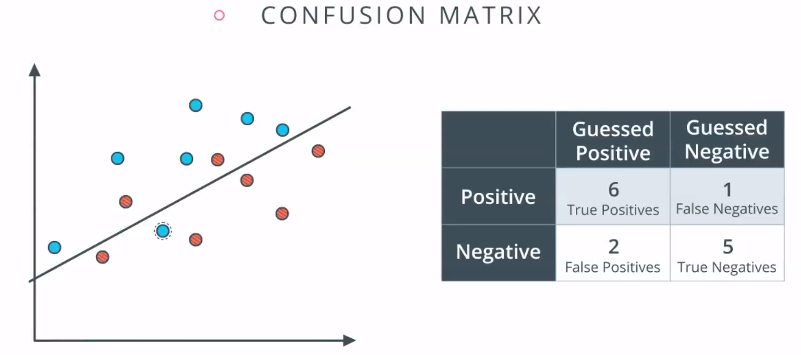

When accuracy doesn't work?

## False Positives and False Negatives

## Recall vs. Precision

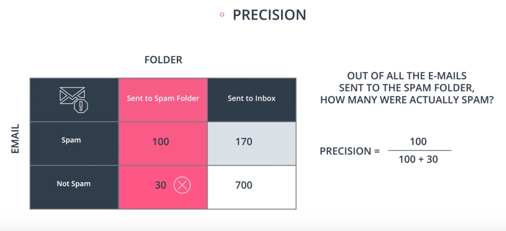

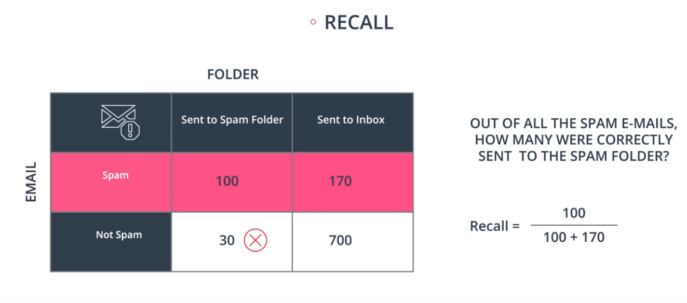

## Types of Errors

## Model Complexity Graph
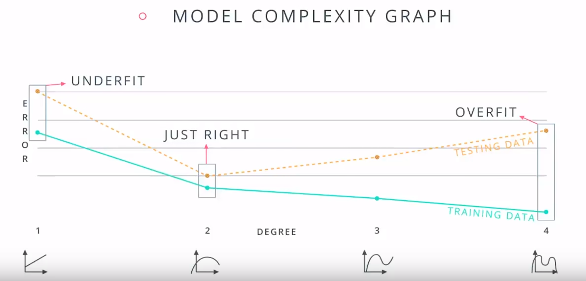
Mistake! Never use your training data for testing
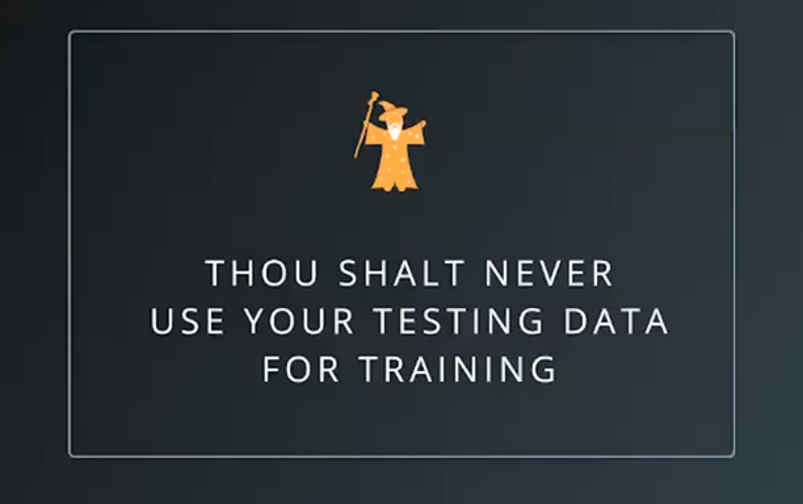

### Solution: Cross Validation

## K-fold Cross Validation
Break data into K bucket. Train our model K times each time a a different bucket as testing data. Average the resulting K models.

## Cross Validation for Time-series 
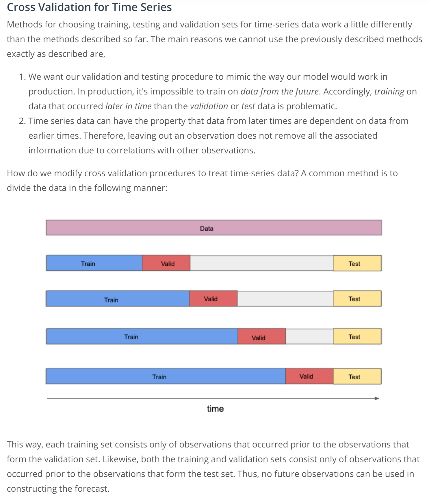

## Learning Curves

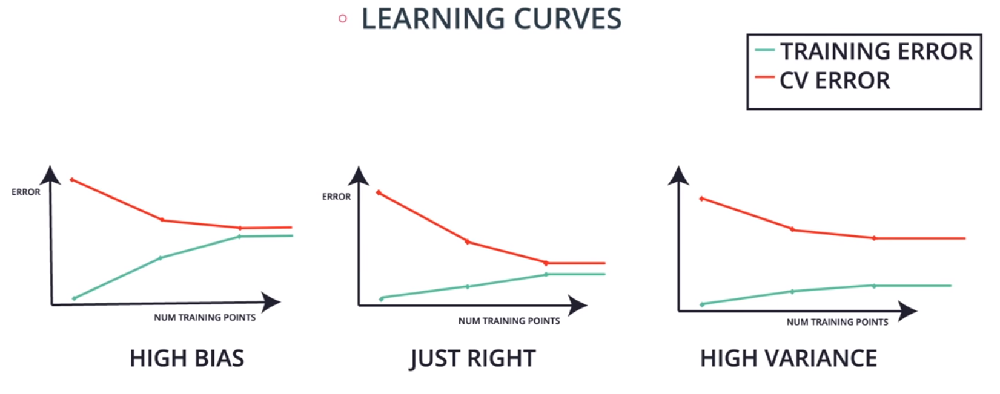

# Random Forests (Ensembling)

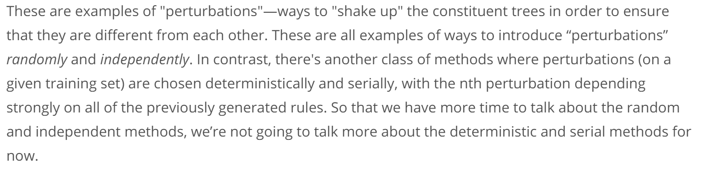

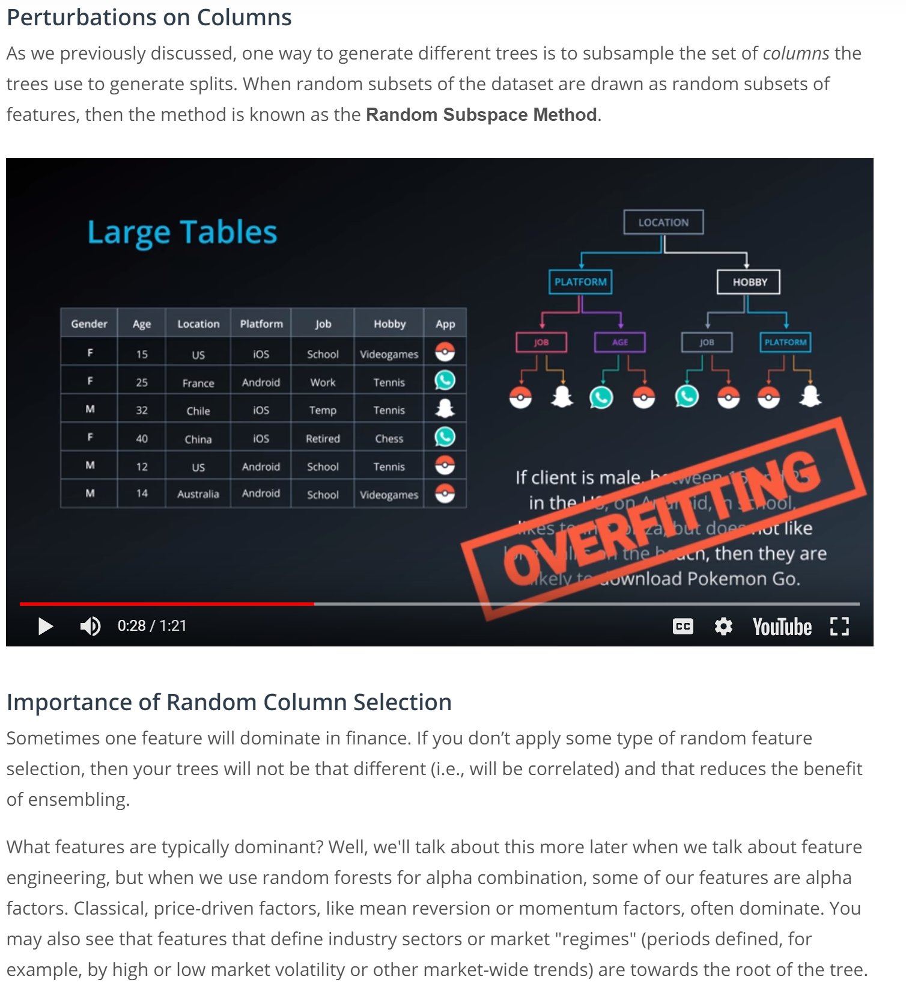

