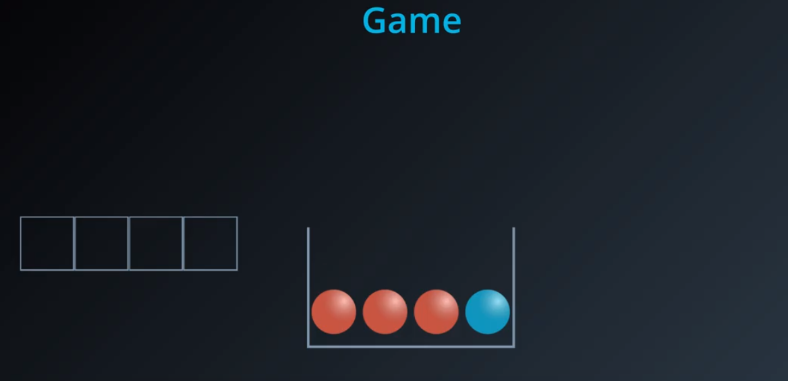
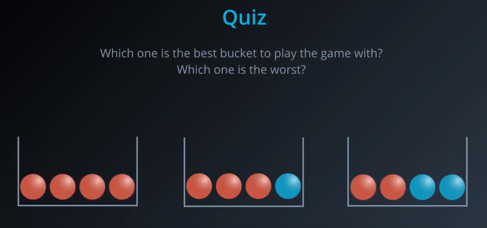
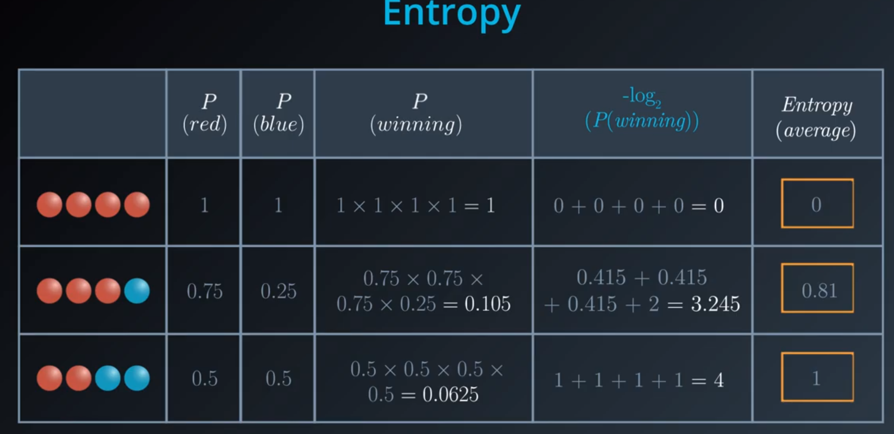
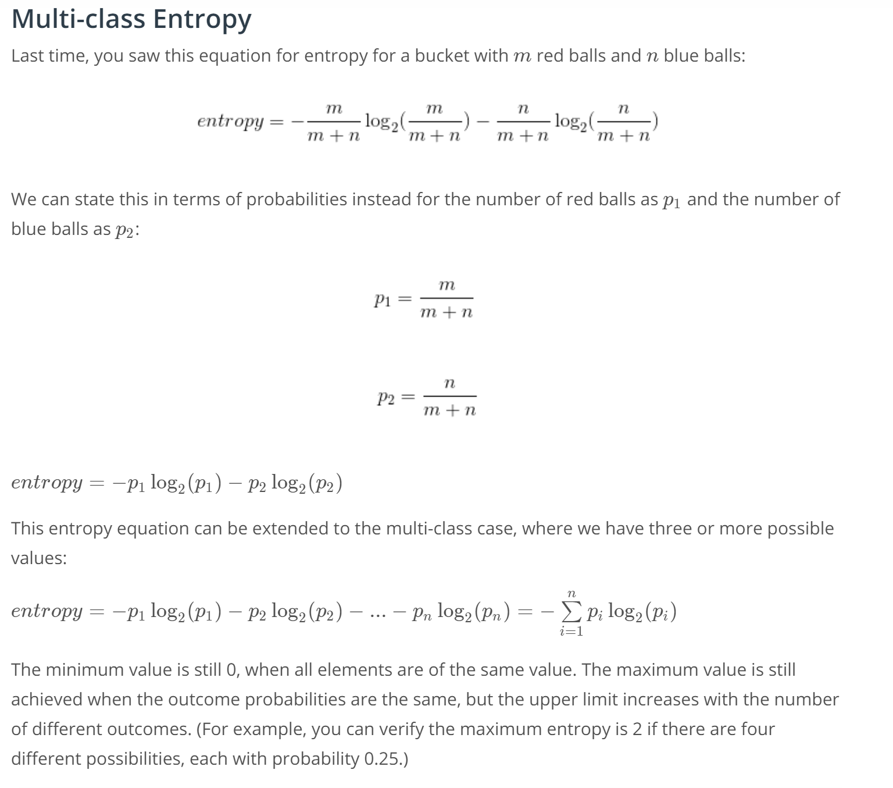

# Decision Tree

## Entropy

Entropy measures number of possibilities to organize balls?

Entropy measures the knowledge of the color of the ball?

### Entropy Formula

Let's play a game. Pick 4 balls from the basket with replacement. Win the game if the colors of the 4 balls (order matters) matches the ones in the basket.

## Information Gain

