# Model Testing and Evaluation

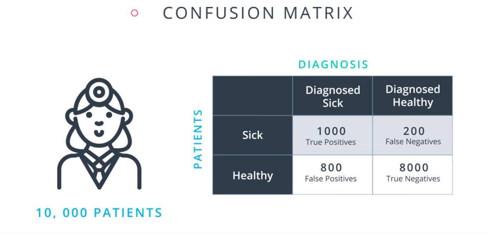
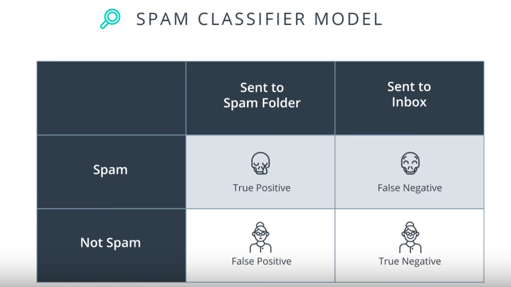
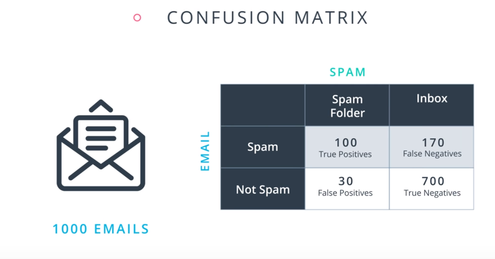

When accuracy doesn't work?
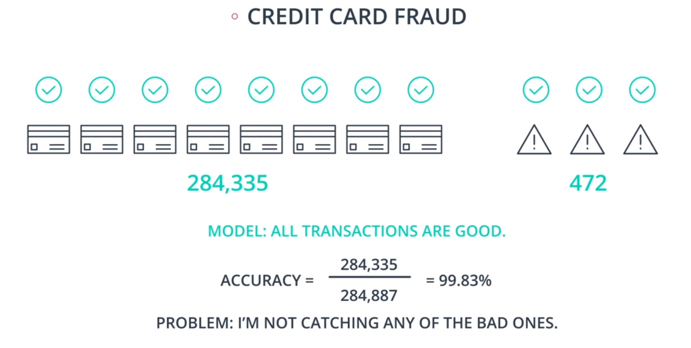

## False Positives and False Negatives

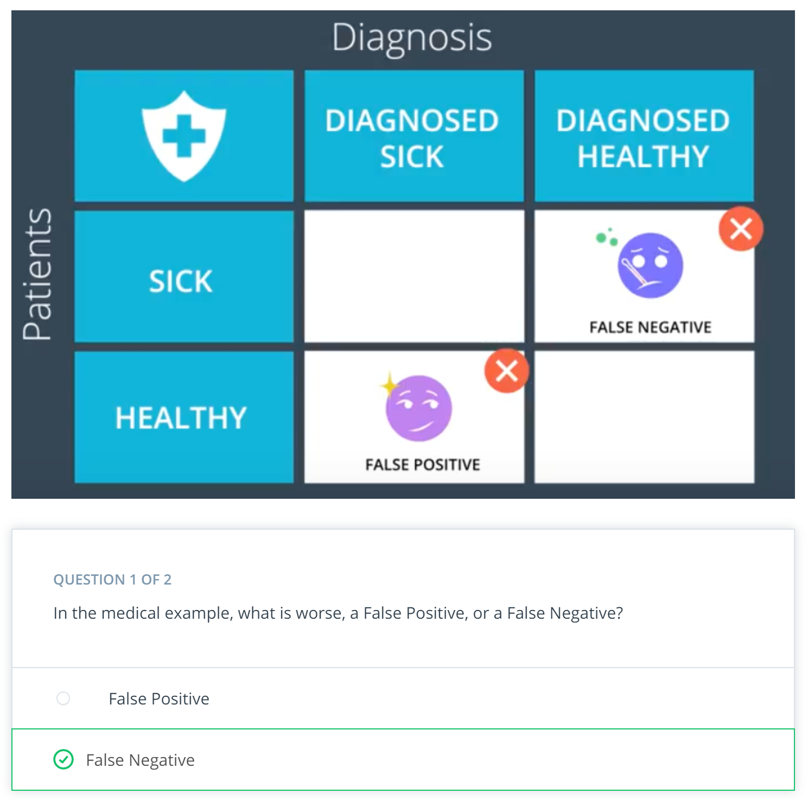

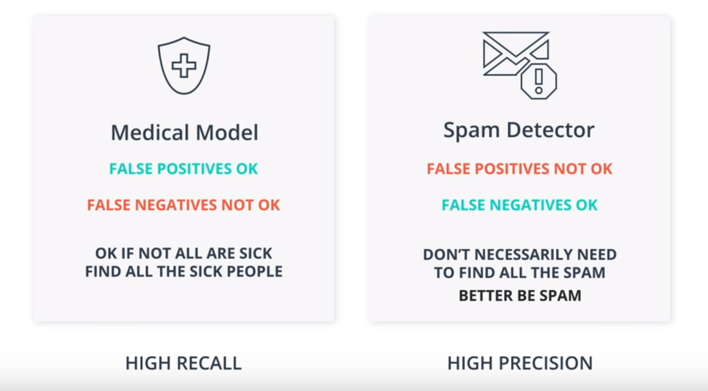

## Recall vs. Precision
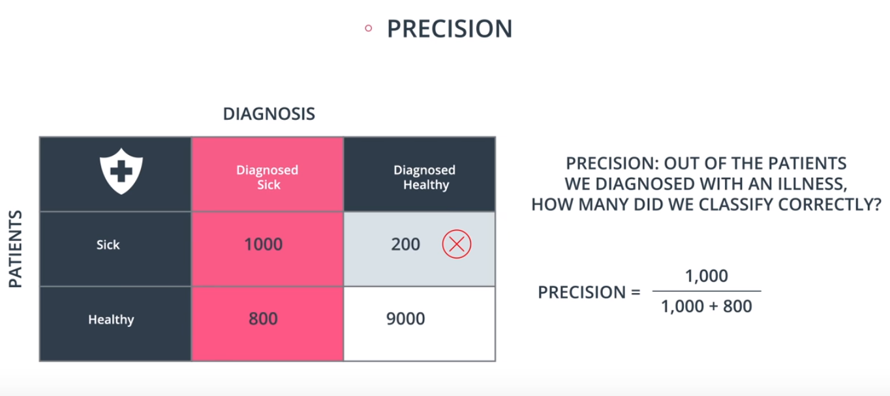

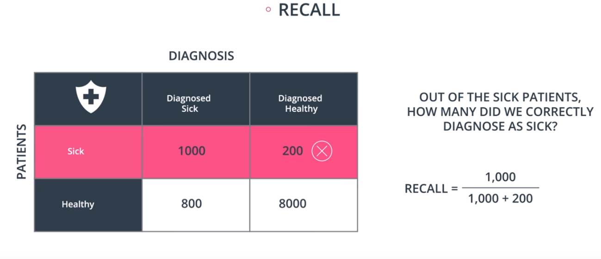

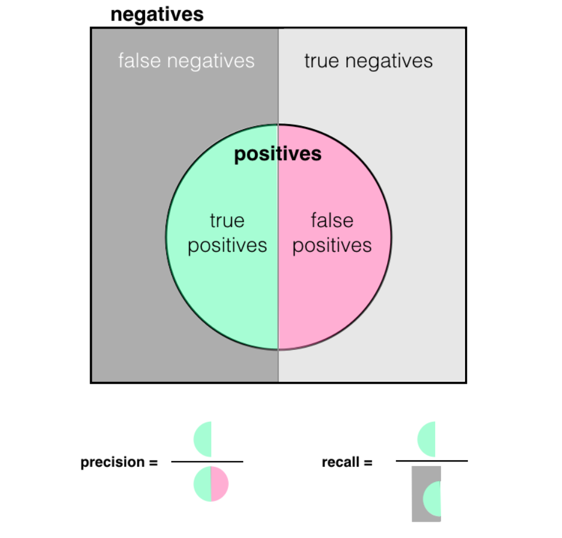

## Types of Errors

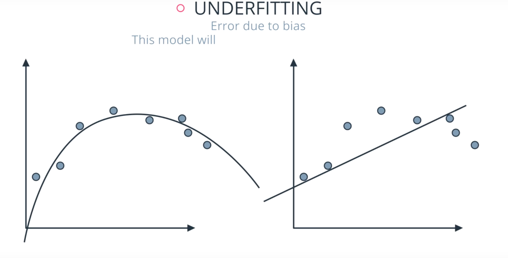
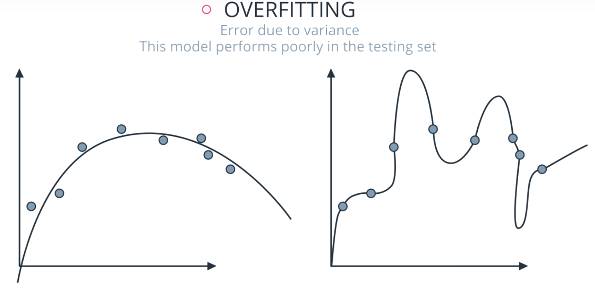

## Model Complexity Graph

Mistake! Never use your training data for testing

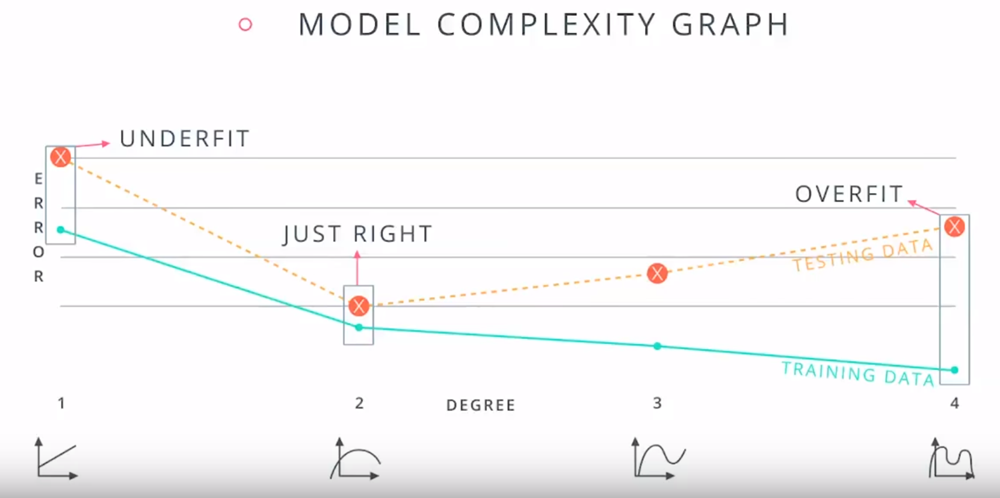

### Solution: Cross Validation
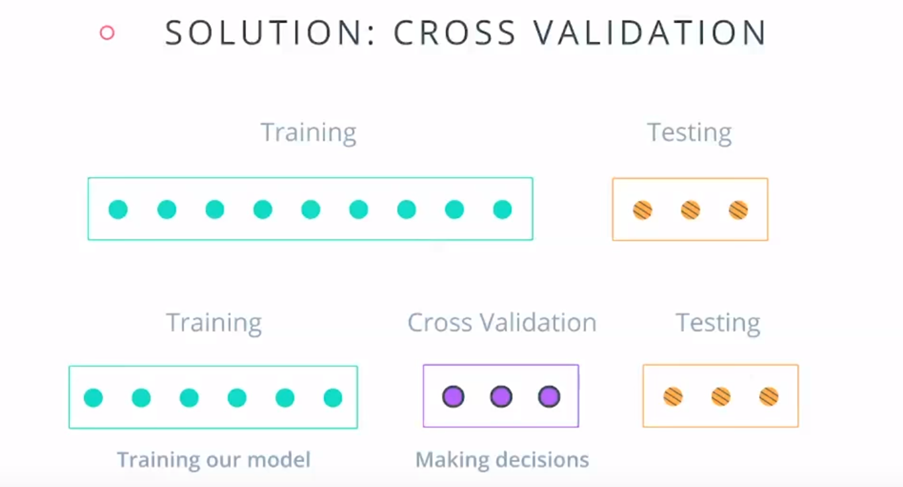
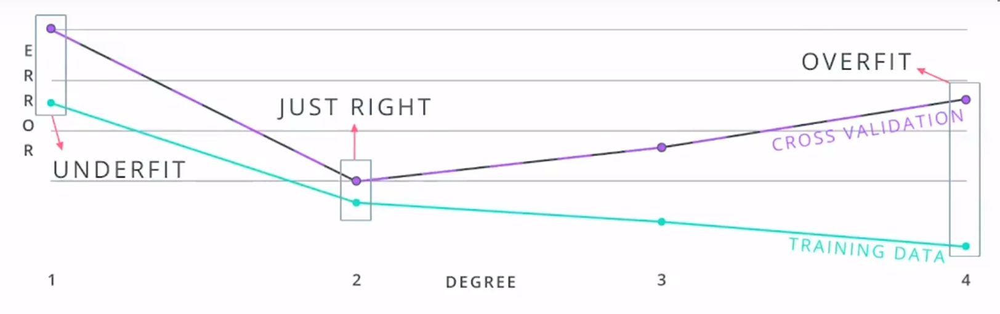

## K-fold Cross Validation
Break data into K bucket. Train our model K times each time a a different bucket as testing data. Average the resulting K models.

## Cross Validation for Time-series 

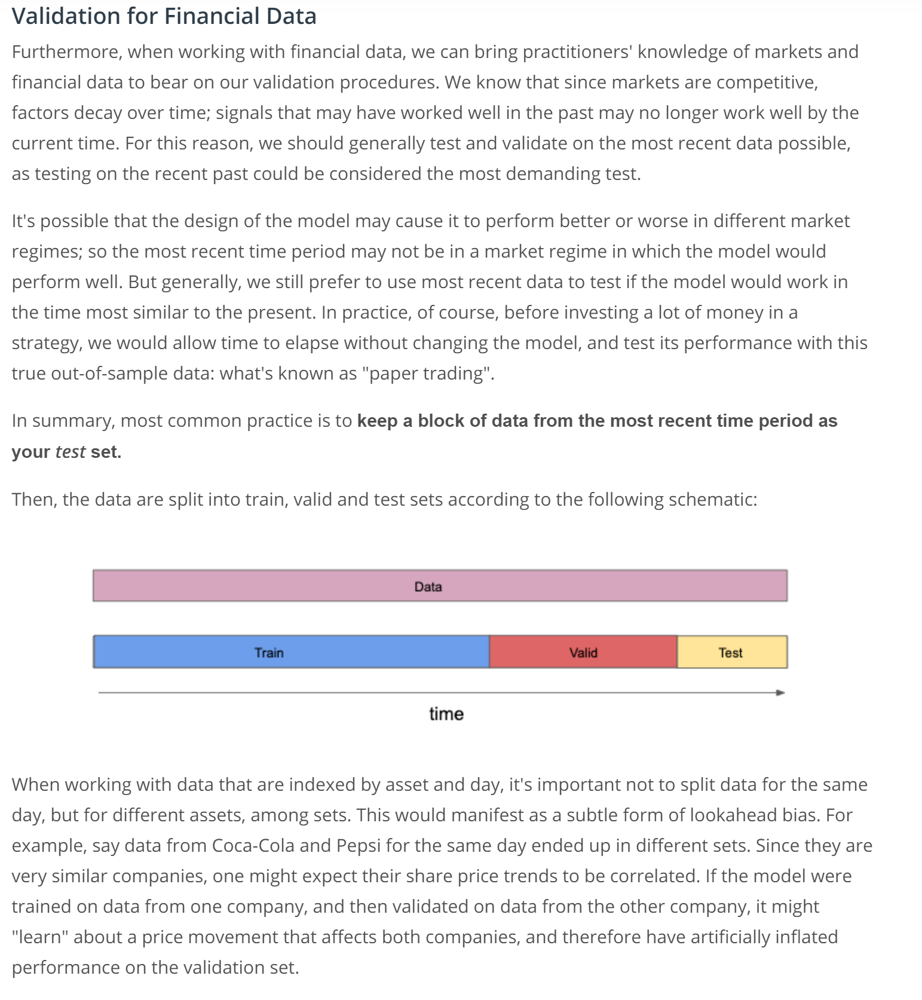

## Learning Curves

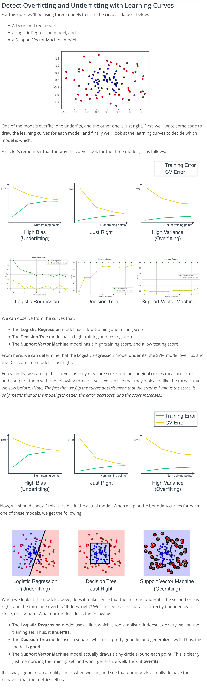