# Decision Tree

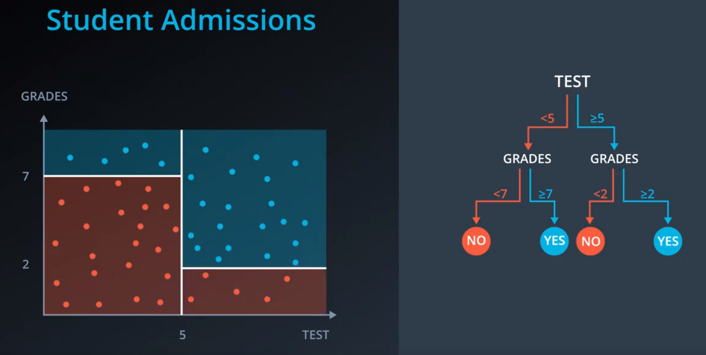

## Entropy
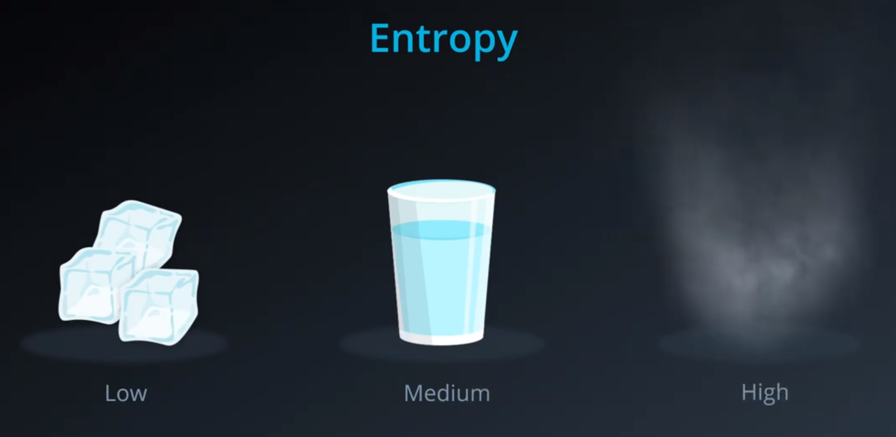

Entropy measures number of possibilities to organize balls?

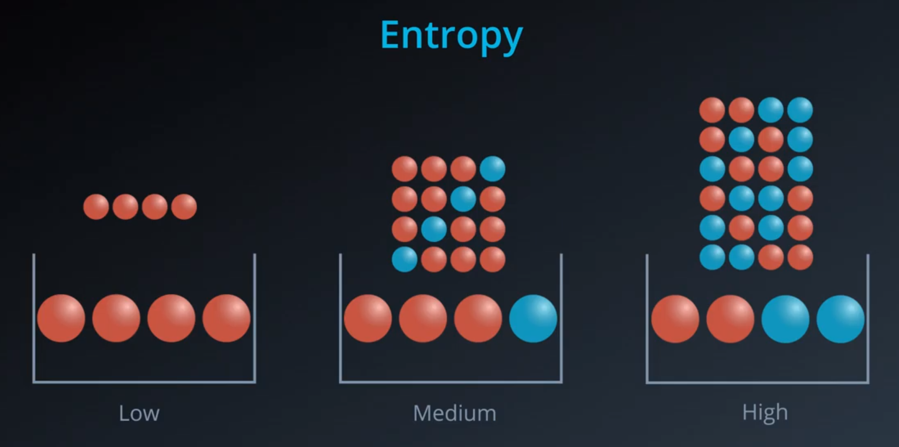

Entropy measures the knowledge of the color of the ball?

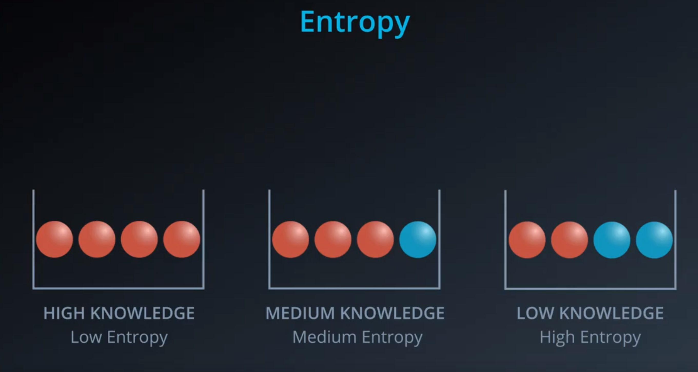

### Entropy Formula

Let's play a game. Pick 4 balls from the basket with replacement. Win the game if the colors of the 4 balls (order matters) matches the ones in the basket.

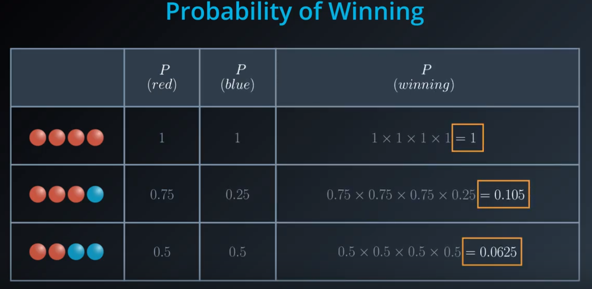

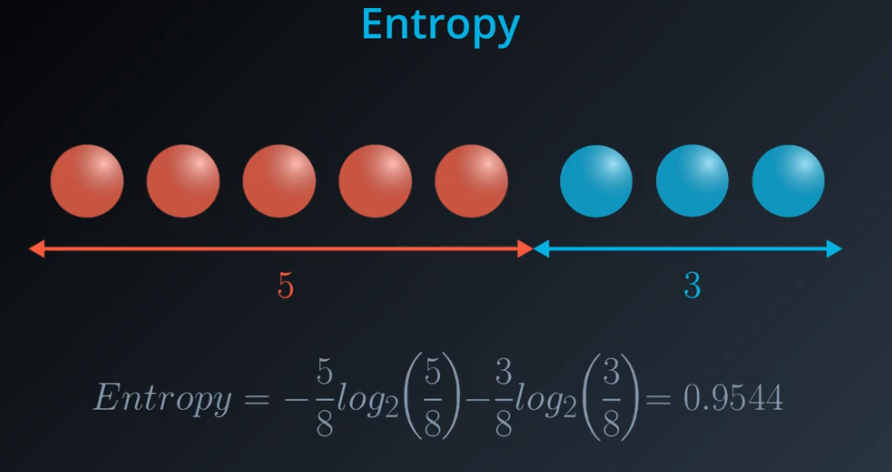

## Information Gain

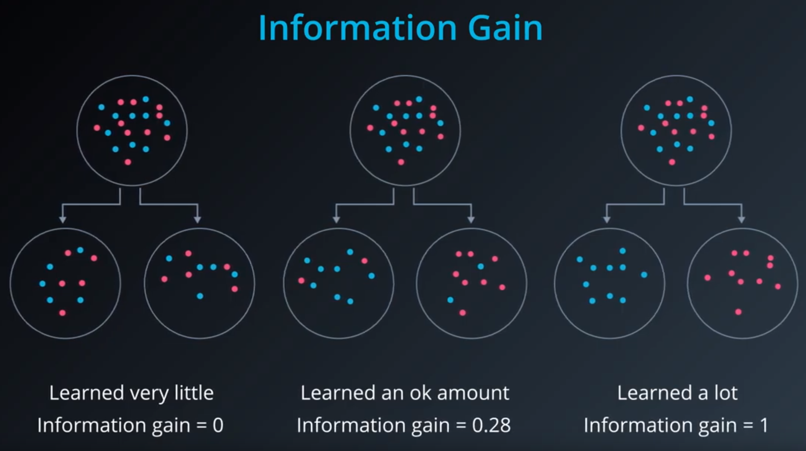

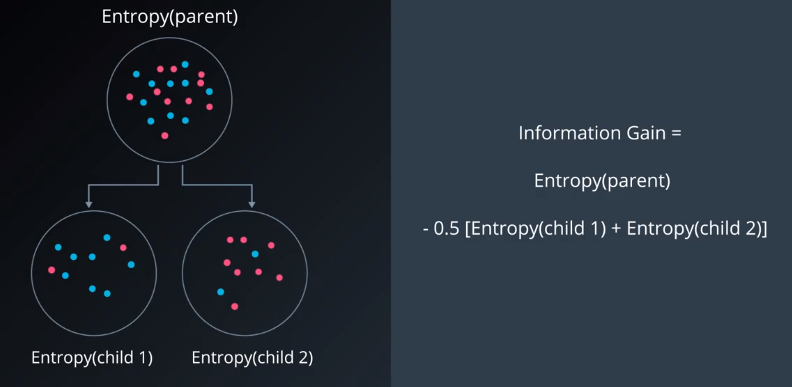

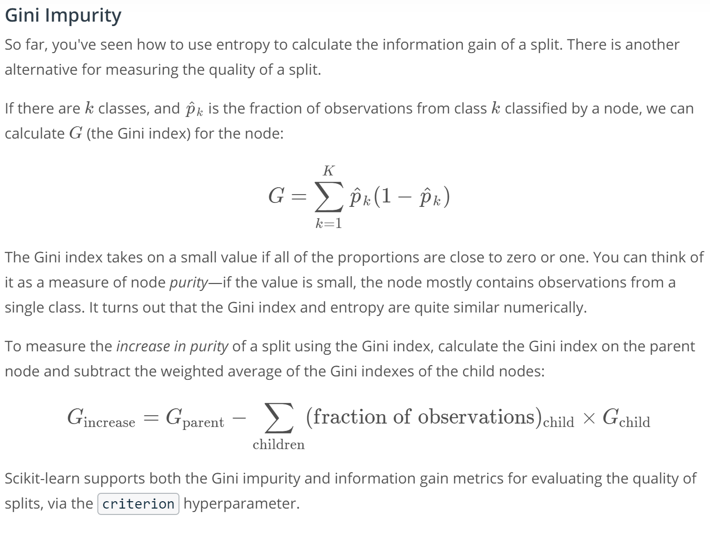

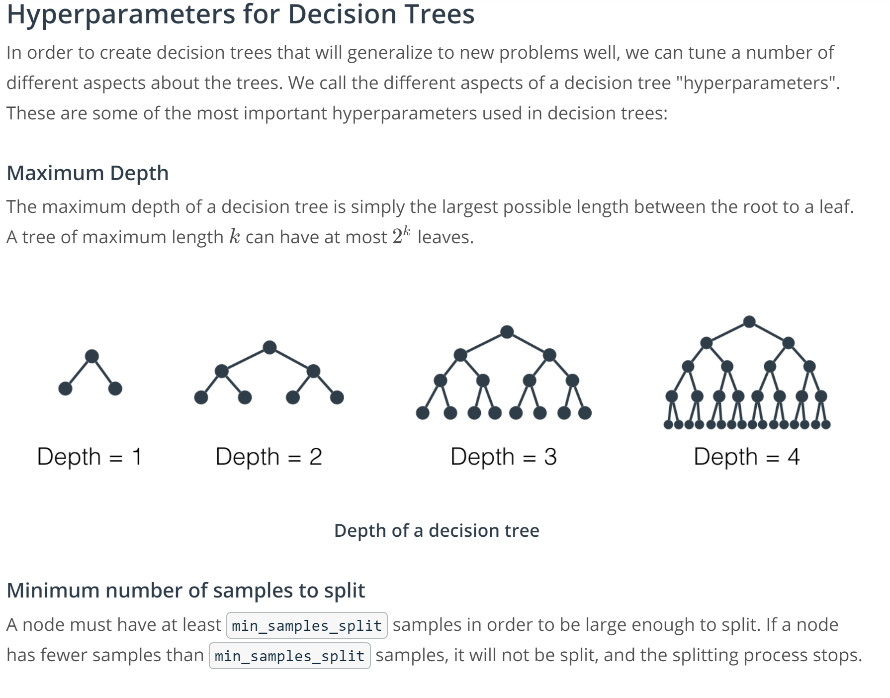

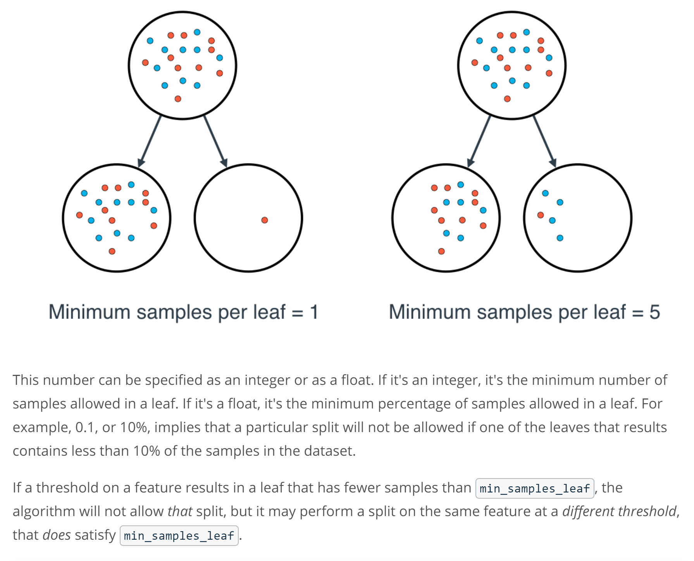
