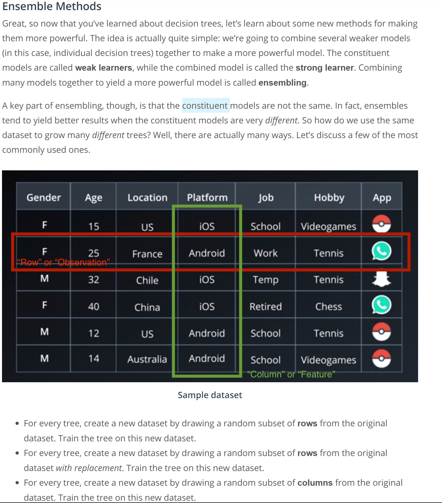
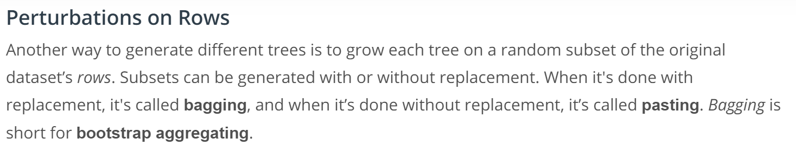
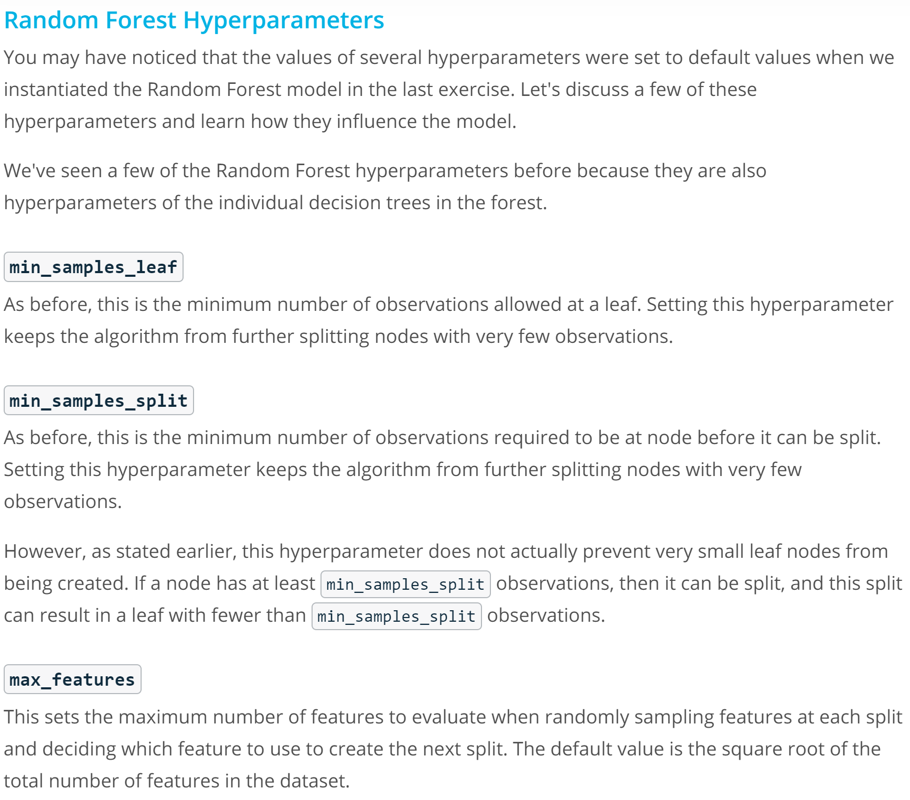
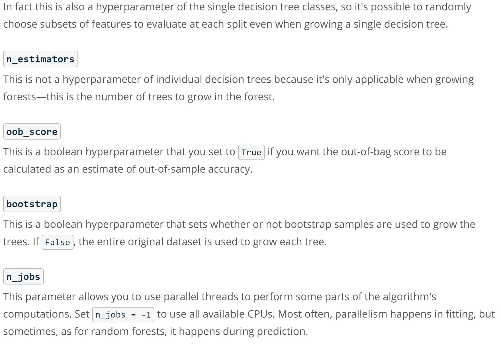
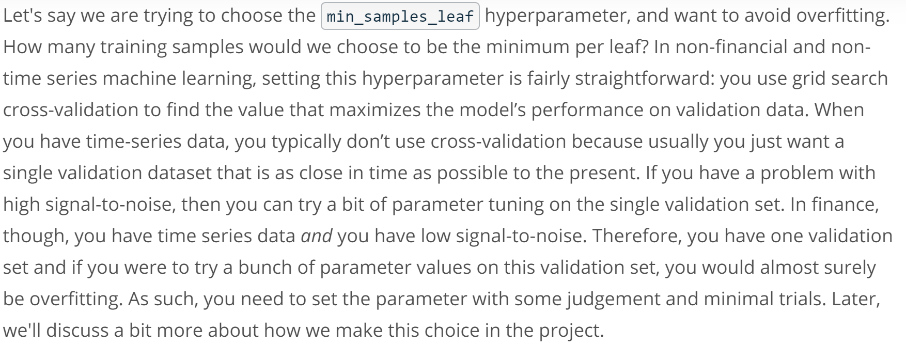
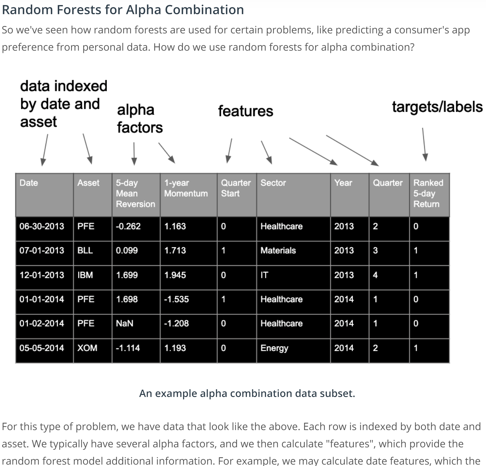
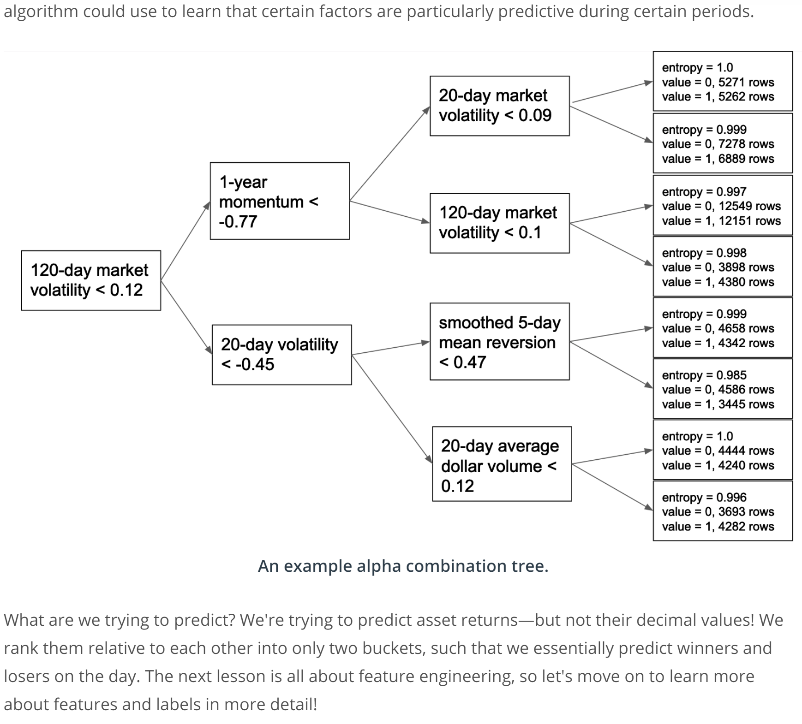

# Random Forests (Ensembling)

## Out-of-Bag Estimation

I can be shown that for bagging (or bootstrapping), each tree will uses around 2/3 of the original observations. Therefore, for each observation, it will not be used to train 1/3 of the trees in the forest. We can use the 1/3 of the tree to predict the observation and aggregate all prediction scores. The out-of-bag error can be calculated by aggregating over the entire data set.

