# Holdings in dollars

We need to consider of the cost of executing trade in backtesting. The size of the portfolio affects the cost of trade execution, which in turn affects how well certain alpha strategy perform. The size of the portfolio affects the size of positions. The size of positions in turn affects how costly it takes to execute a trade. (For the backtest, the positions for each asset will now be in units of dollars, instead of weights. To make this distinction, we'll use the letter "h" for holdings, instead of the "x" that we had used for weights in prior projects and lessons.)
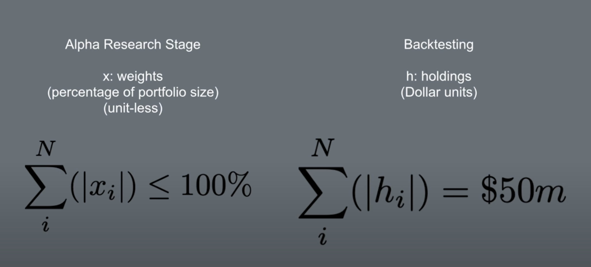
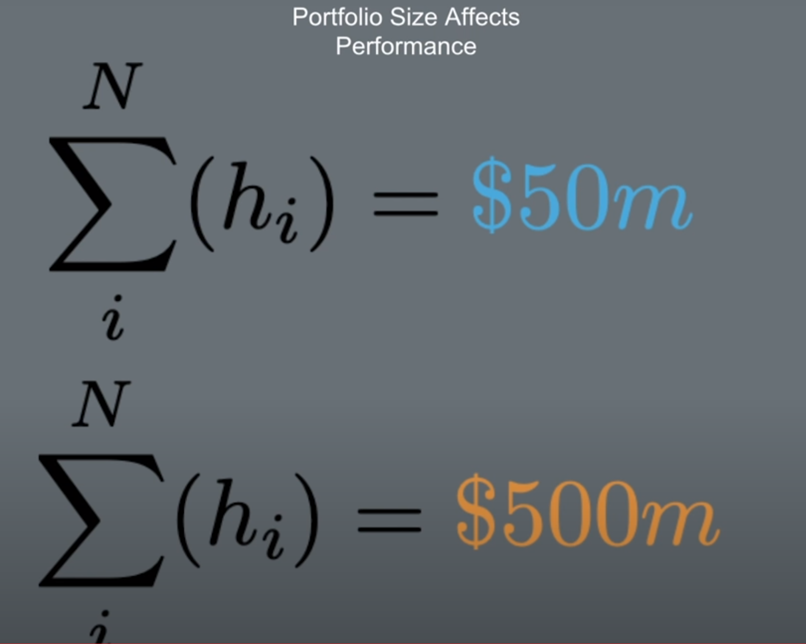

# Scaling alpha factor
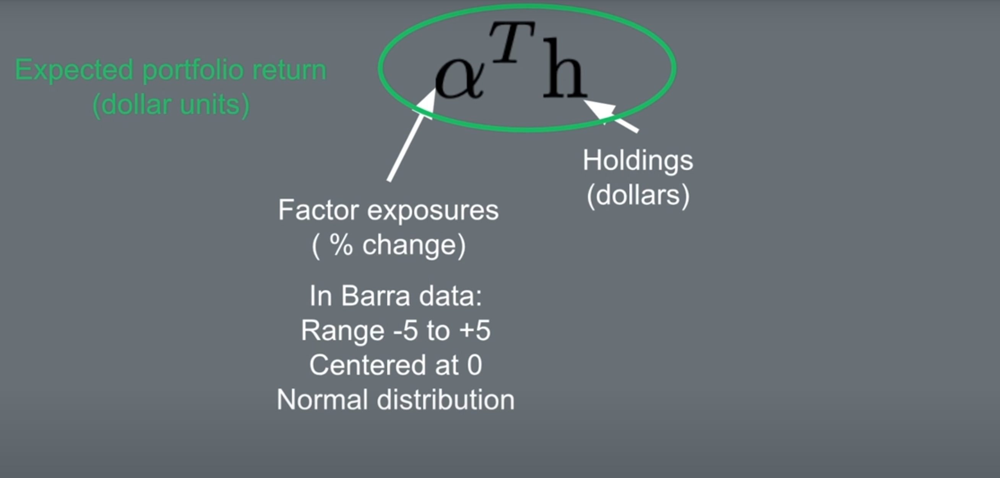
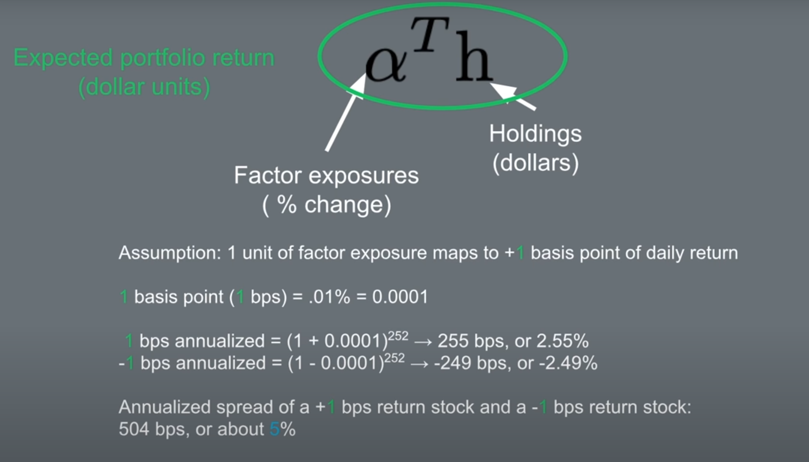
To scale the alpha vector so that the expected portfolio return is in units of dollars, multiply the alpha vector by 1 basis point (1/10,000).
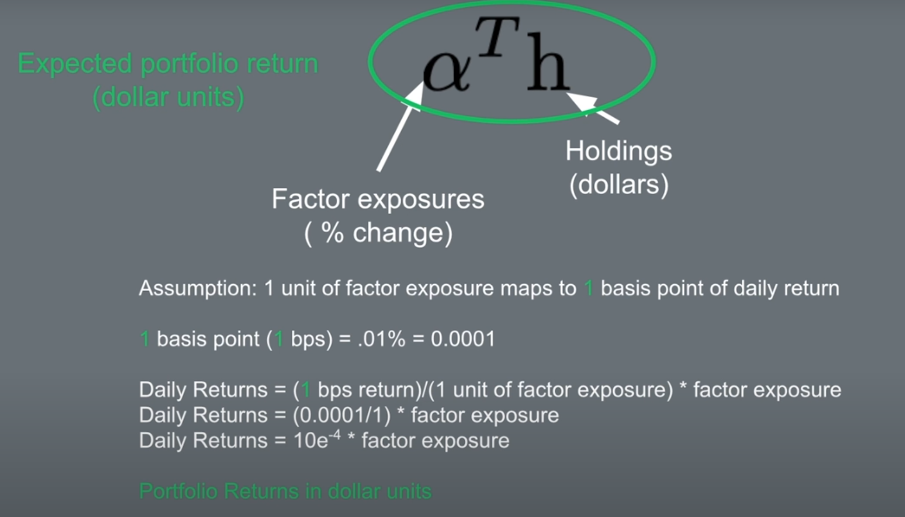

# Transaction costs
For institutional traders, the cost is due to the impact a trade has on the market price of the asset being bought or sold.
* Buying: pushes price upward
* Selling: pushes price downward

A “limit order book”, is a list of all the bids and asks for an asset that are made by market participants. Bids are commitments to buy a certain quantity of an asset at a specified price. “Asks”, also called “offers” are promises to sell a certain quantity of the asset at a specified price.

The distance between these two market orders is called the spread, as in the bid-ask spread. The point at the middle of the bid-ask spread is called the midpoint price. The midpoint price is used as benchmark from which to calculate transaction costs.

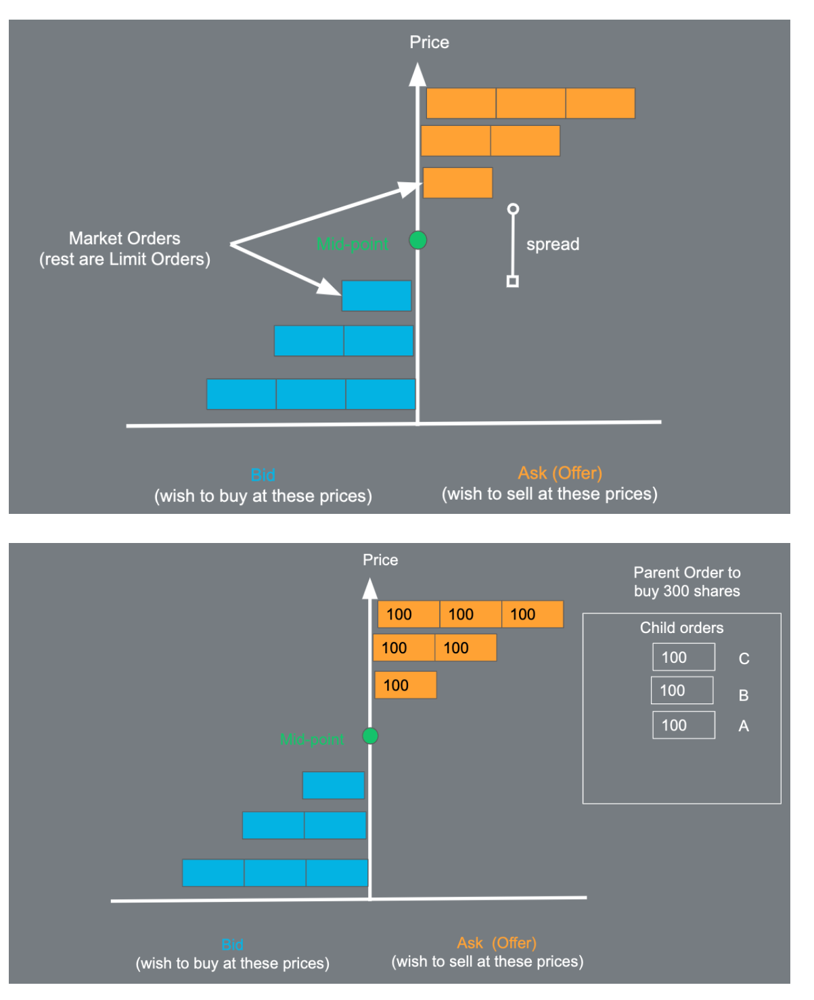

The midpoint price can serve as the benchmark from which we estimate the transaction cost. For each child order that is traded, the difference between the price paid and this benchmark is a measure of the trade cost, which is called “slippage.” We can think of slippage as the sum of two kinds of price impact. There’s the temporary price impact, and permanent price impact.

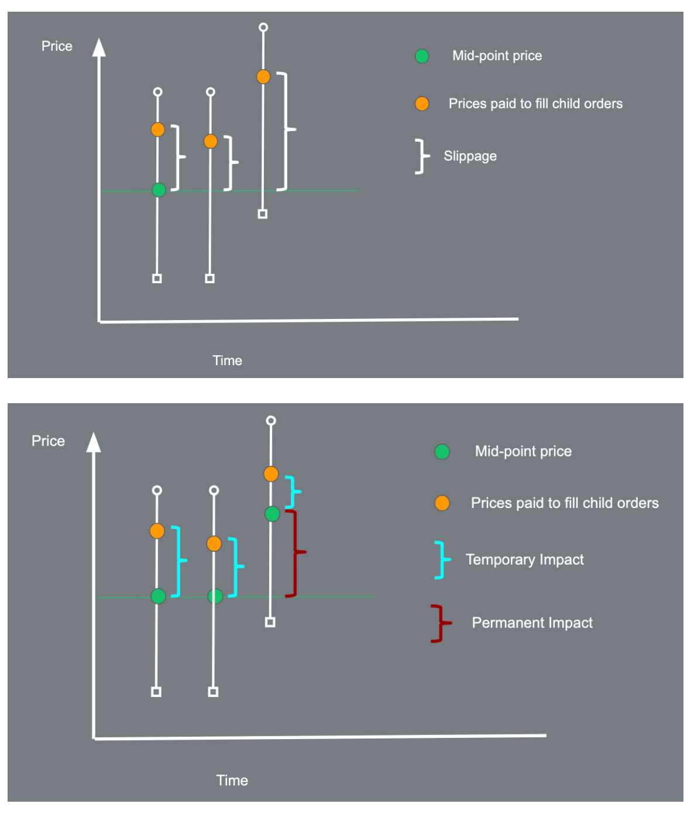

# Transaction cost formula
The assumption that we'll use is that when the trade is 1% of Average Daily Volume, the price changes by 10 basis points. The transaction cost is the percent change in price times the amount traded.
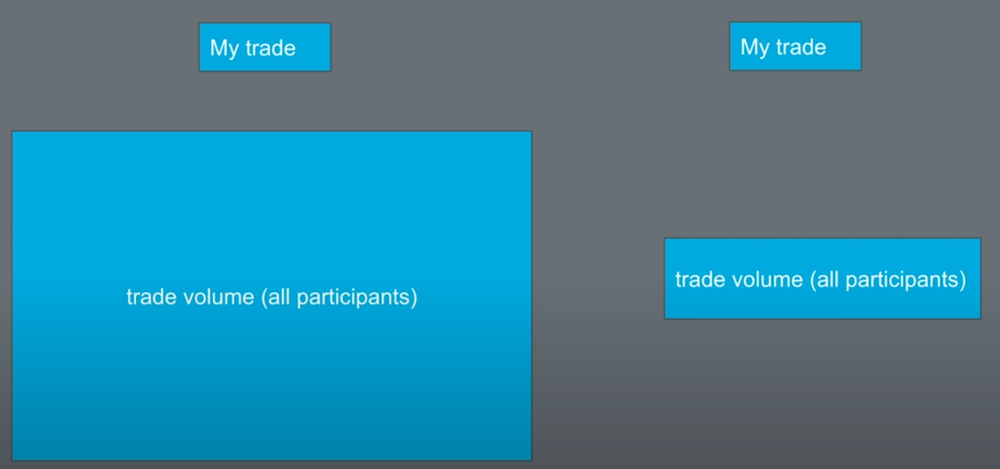
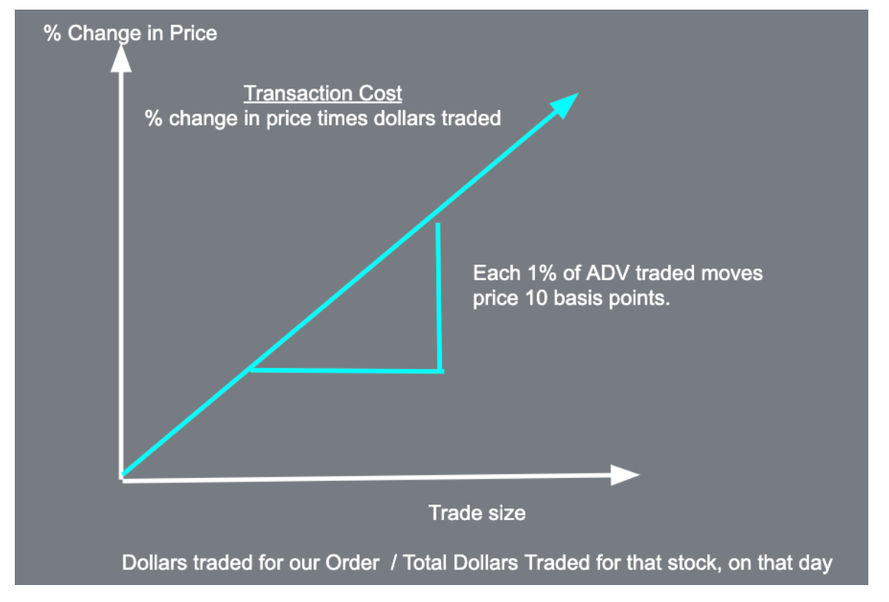

# Optimization without constraints

## Using the objective function instead of constraints
Assume an optimization objective function has the following terms to minimize:

Objective Function = common Risk + Specific Risk - Expected Return + Transaction Costs

We have some goals that we previously satisfied using constraints:

Market neutral

Position Size

Portfolio Diversification

Can you think about which term in the objective function also serves a similar purpose as these constraints?

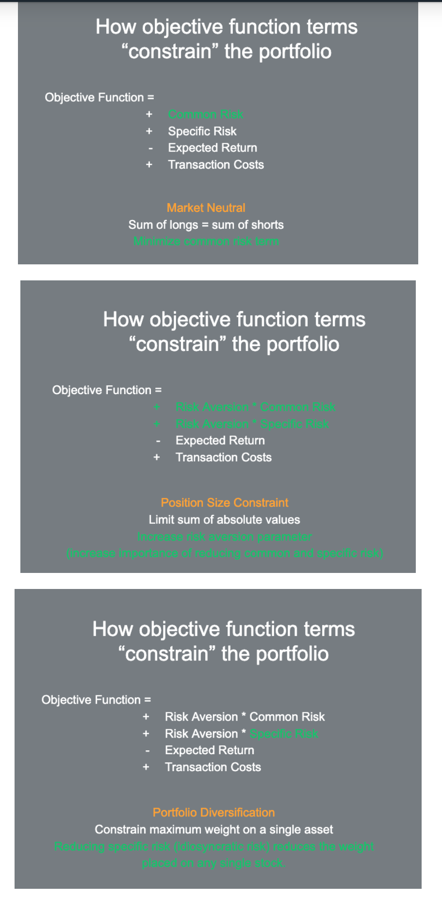

# Risk factor matrix
When filling the risk factor matrix, we can use just the variances and set the covariances in the off-diagonals to zero. This makes optimization more efficient.

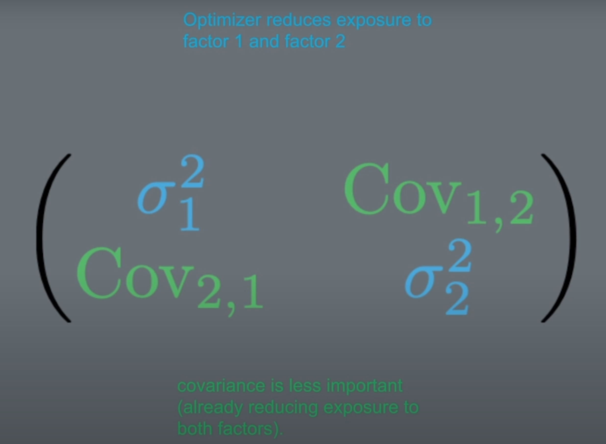

# Avoid N by N matrix

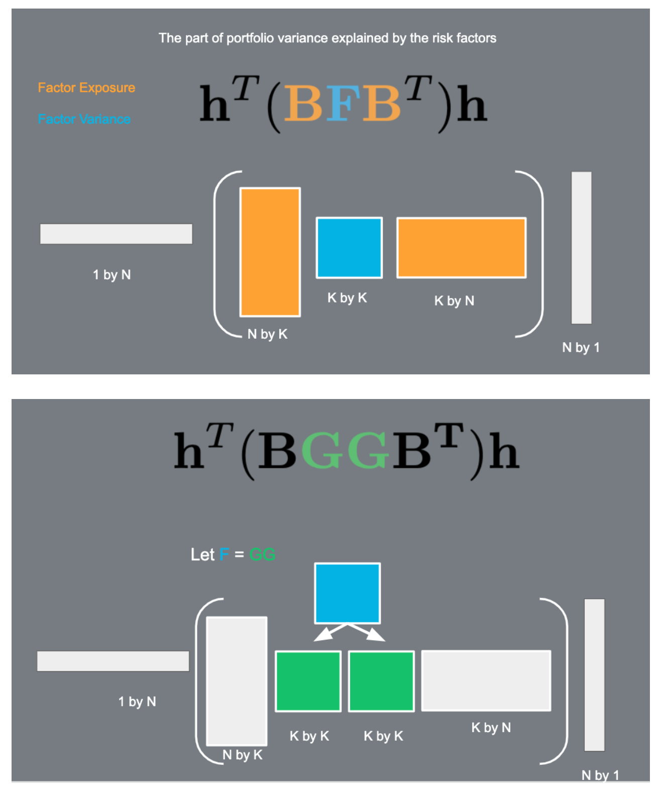

# Risk aversion parameter
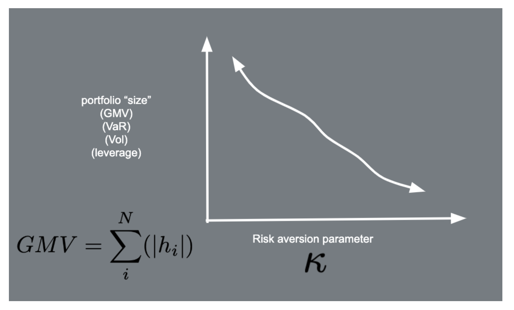

# Optimization Overview in Scipy
This Scipy link [Mathematical optimization](http://scipy-lectures.org/advanced/mathematical_optimization/) is a good reference on the various optimizers that are available in scipy. In addition to the L-BFGS method, other optimizers worth trying are Powell, Nelder-Mead, and Conjugate Gradient optimizers.